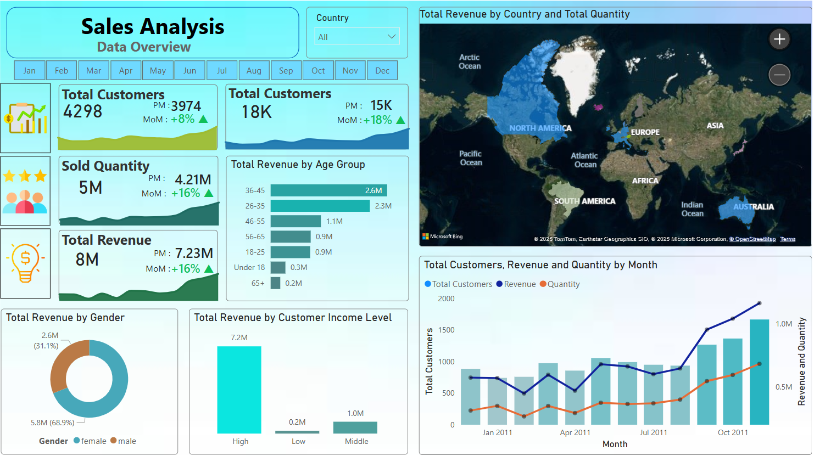

# **Sales Analysis Project Report**  

Check the Live Dashboard [Here](https://app.powerbi.com/view?r=eyJrIjoiMjk4MWJiYzYtYTBjNS00YjExLTgwYmEtNDUxOGMxMThjNjMwIiwidCI6ImY5YWU1ZTMxLTQyMzYtNGZmNi05NWMwLTEyMzUxNDhmMTExMSIsImMiOjEwfQ%3D%3D)  

---

1. [Executive Summary](#executive-summary)  
2. [Project Overview](#project-overview)  
3. [Objectives](#objectives)  
4. [Data Sources](#data-sources)  
5. [Data Modeling](#data-modeling)  
6. [Data Preprocessing](#data-preprocessing)  
7. [Advanced DAX Measures](#advanced-dax-measures)  
8. [Insights Gained](#insights-gained)  
9. [Key Findings](#key-findings)  
10. [Business Recommendations](#business-recommendations)  
11. [Future Work](#future-work)  

---

## **Executive Summary**  
This project focuses on analyzing sales data to uncover trends, customer behavior, and performance metrics. By leveraging **RFM (Recency, Frequency, Monetary) segmentation** and **Cohort Analysis**, the analysis provides actionable insights into customer retention, revenue generation, and sales trends. Key findings include revenue distribution by demographics, geographical sales performance, and customer retention rates. The project aims to optimize sales strategies, improve customer engagement, and drive business growth through data-driven decision-making.

---

## **Project Overview**  
The project involves analyzing sales data to understand customer behavior, sales trends, and revenue distribution. Key steps include:  
1. **Data Cleaning and Preprocessing:** Handling missing values, filtering inconsistent data, and transforming data for analysis.  
2. **Feature Engineering:** Creating new features like age groups, income levels, and aggregate metrics.  
3. **Dimensional Modeling:** Structuring data into a star schema with fact and dimension tables.  
4. **Advanced DAX Calculations:** Creating measures for **RFM segmentation**, **Cohort Analysis**, customer retention, and churn rates.  
5. **Visualizations:** Building interactive dashboards to showcase key metrics and trends.  

The use of **RFM segmentation** helps identify high-value, at-risk, and loyal customers, while **Cohort Analysis** provides insights into customer retention and churn trends over time. These techniques enable targeted marketing strategies and improved customer engagement.

---

## **Objectives**  
1. Analyze sales performance and revenue trends over time.  
2. Understand customer demographics and their impact on revenue.  
3. Segment customers using **RFM analysis** to identify high-value, at-risk, and loyal customers.  
4. Perform **Cohort Analysis** to evaluate customer retention and churn rates.  
5. Identify geographical sales performance and high-revenue regions.  
6. Provide actionable recommendations for improving sales strategies and customer retention.  

---

## **Data Sources**  
The analysis is based on the following datasets:  
1. **FactSales:** Contains transaction-level data, including `InvoiceNo`, `CustomerID`, `InvoiceDate`, `Quantity Sold`, and `Revenue`etc.  
2. **DimCustomer:** Stores customer details such as `CustomerID`, `Age`, `Gender`, `Income Level`, `Country`, and `Region`etc.  
3. **DimDate:** Provides time-based attributes for trend analysis, including `Year`, `Month`, `Quarter`, and `Day of Week` etc.  

---

## **Data Modeling**  
The data model follows a **star schema** with the following tables:  

---

## **Data Preprocessing**  
The following preprocessing steps were performed:  

### **1. Data Cleaning**  
- Handled missing values by removing or imputing them.  
- Filtered out erroneous or inconsistent data points.  

### **2. Feature Engineering**  
- Created new features like age groups and income levels.  
- Generated aggregate metrics such as total revenue and purchase frequency.  

### **3. Data Transformation**  
- Converted data types for consistency (e.g., date formatting).  
- Extracted time-based features like year, month, and quarter.  

### **4. Data Aggregation & Summarization**  
- Created fact tables summarizing transactions per customer or invoice.  
- Aggregated key metrics such as total revenue and total quantity per transaction.  

### **5. Dimensional Modeling**  
- Structured data into a star schema with `FactSales`, `DimCustomer`, and `DimDate` tables.  

### **6. Cohort Analysis**  
- Grouped customers based on their first purchase date to analyze retention trends.  

### **7. Data Normalization**  
- Split datasets into structured tables to reduce redundancy and improve efficiency.  

---

## **Advanced DAX Measures**  
The following advanced DAX measures were created:  

| **Measure Name**               | **Expression**                                                                 |
|--------------------------------|-------------------------------------------------------------------------------|
| **Total Customers**            | `DISTINCTCOUNT(FactSales[CustomerID])`                                        |
| **Total Revenue**              | `SUM(FactSales[Total Revenue])`                                               |
| **Total Sold Quantity**        | `SUM(FactSales[Total Quantity])`                                              |
| **Total Orders**               | `COUNT(FactSales[InvoiceNo])`                                                 |
| **Total Customer Cohort**      | `VAR minDate = MIN(DimDate[Start of the Month]) VAR maxDate = MAX(DimDate[Start of the Month]) RETURN CALCULATE([Total Customers], REMOVEFILTERS(DimDate[Start of the Month]), RELATEDTABLE(DimCustomer), DimCustomer[FirstTransactionMonth] >= minDate && DimCustomer[FirstTransactionMonth] <= maxDate)` |
| **Customer Retention Rate**    | `VAR CustomersFirstMonth = CALCULATE([Total Customers], FILTER(ALL(FactSales[MonthsSinceFirstPurchase]), FactSales[MonthsSinceFirstPurchase] = 0)) VAR retention = DIVIDE([Total Customers], CustomersFirstMonth) RETURN retention` |
| **New Customers**              | `CALCULATE([Total Customers], FactSales[MonthsSinceFirstPurchase] = 0)`       |
| **Churned Customers**          | `SWITCH(TRUE(), ISBLANK([Customer Retention Rate]), BLANK(), [New Customers] - [Total Customer Cohort])` |
| **Churned Rates**              | `VAR CustomersFirstMonth = CALCULATE([New Customers], FILTER(ALL(FactSales[MonthsSinceFirstPurchase]), FactSales[MonthsSinceFirstPurchase] = 0)) VAR churned = DIVIDE([Churned Customers], CustomersFirstMonth) RETURN churned` |

---
## **Dashboards and Live Links**  

" alt="RFM" width="800" height="450" />

## **Insights Gained**  
1. **Revenue Distribution:**  
   - Customers aged 36-45 and 26-35 contribute the most revenue.  
   - Male customers and high-income groups dominate sales.  

2. **Geographical Performance:**  
   - North America, Europe, and Australia are the highest revenue-generating regions.  

3. **Customer Retention:**  
   - Retention rates vary across cohorts, with opportunities to improve engagement for at-risk customers.  

4. **Sales Trends:**  
   - Sales show a growing trend, particularly in the later months of 2011.  

---

## **Key Findings**  
1. **High-Value Customers:** Identified through **RFM segmentation**, these customers contribute significantly to revenue and require targeted retention strategies.  
2. **Cohort Analysis:** Revealed trends in customer retention and churn, highlighting opportunities for re-engagement campaigns.  
3. **Geographical Insights:** North America, Europe, and Australia are key regions for revenue generation.  
4. **Demographic Insights:** Male customers and high-income groups are the primary revenue drivers.  

---

## **Business Recommendations**  
1. **Target High-Value Customers:** Use **RFM segmentation** to focus on high-value customers for personalized marketing.  
2. **Improve Retention Rates:** Implement loyalty programs and re-engagement campaigns for at-risk customers identified through **Cohort Analysis**.  
3. **Expand in High-Revenue Regions:** Invest in marketing and logistics in North America, Europe, and Australia.  
4. **Optimize Pricing Strategies:** Test price adjustments for high-demand products to maximize profitability.  
5. **Enhance Customer Experience:** Address factors contributing to churn, such as product quality and delivery times.  

---

## **Future Work**  
**Customer Lifetime Value (CLV):** Develop a CLV model to identify high-value customers.  
  
--- 
